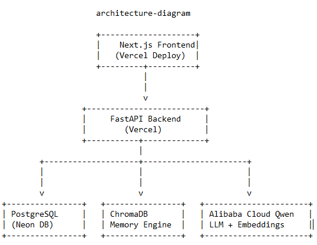

# MentorOS — AI Student Growth Platform with Persistent Memory

AI-powered Student Growth Platform with Persistent Memory built using **Alibaba Cloud Qwen, FastAPI, PostgreSQL, ChromaDB, and Next.js**.

MentorOS remembers each student's learning journey and continuously generates personalized career recommendations, skill-gap analysis, project ideas, and learning roadmaps using long-term semantic memory.

## Team

**Team Name:** MentorOS

| Name | Role |
|------|------|
| Muhammad Bilal Hussain | Team Lead • Backend • AI • Memory Engine |
| Noor Fatima | Presentation • UI/UX • Documentation • Testing |

**Qwen Global AI Hackathon 2026 — Track 1 (MemoryAgent) Submission**

A full-stack app: **FastAPI + SQLAlchemy + ChromaDB + Qwen** backend, **Next.js 15 + TypeScript** frontend.

## What's implemented

### Backend (`backend/`)
- **Auth** — register, login (JWT), `GET /auth/me`, `POST /auth/refresh` (silent session renewal). Login also triggers a memory decay pass.
- **Student data** — Profile, Skills, Projects, Certificates, Career Goals, all CRUD, all scoped to the authenticated user. A new Career Goal automatically **supersedes** the previous one (preserved, not deleted).
- **Resume upload** — PDF/.txt → Qwen structured extraction → written into the real domain tables + memory.
- **Memory Engine** (`app/memory_engine/`) — every fact is embedded into ChromaDB and tracked in SQL with an importance score. Retrieval does cosine-similarity search re-ranked by importance. Forgetting has two mechanics: **supersession** (contradiction) and **decay** (time-based, archives low-importance memories on login).
- **AI Recommendations** — roadmap, skill-gap analysis, and project ideas, all grounded in retrieved memory via Qwen, and written back into memory.

### Frontend (`frontend/`)
Next.js 15 (App Router) + TypeScript, Tailwind CSS, shadcn/ui-style components, TanStack Query, Axios, Recharts, next-themes (dark/light), Lucide icons.

**Pages**: Login, Register, Dashboard, Profile, Resume Upload & Analysis, Skills, Projects, Certificates, Memory Timeline, AI Recommendations, Career Goals, Settings.

**Dashboard** includes: summary cards (skills/projects/certificates/goal counts), a memory statistics pie chart (active/superseded/archived), a skill-level bar chart, resume status, an AI recommendation panel, a recent-activity timeline, and quick-action buttons.

**Auth**: JWT stored client-side, attached via an Axios request interceptor. Token refresh is automatic in two layers:
1. **Proactive** — the app decodes the JWT's `exp` claim and silently calls `POST /auth/refresh` ~2 minutes before expiry.
2. **Reactive** — an Axios response interceptor catches any 401, attempts one refresh, retries the original request, and only redirects to `/login` if the refresh itself fails.

This required one small, purely additive backend change: `POST /auth/refresh` (see `backend/app/routers/auth.py`) — no existing endpoint's behavior changed.

## System Architecture

The following diagram illustrates how the frontend, backend, database, memory engine, and Alibaba Cloud Qwen interact.




## Architecture

```
backend/
  app/routers/        → thin HTTP layer
  app/services/        → business logic
  app/repositories/    → all direct DB access
  app/memory_engine/   → writer, retriever, importance, decay, chroma_client
  app/ai/               → LLMProvider interface + QwenClient + prompts
  app/models/, app/schemas/

frontend/
  app/                  → Next.js App Router pages (route groups: (app) = protected shell)
  components/ui/        → shadcn-style primitives (button, card, dialog, select, ...)
  components/           → domain components (dashboard/, skills/, memory/, ...)
  hooks/                 → TanStack Query hooks, one per domain
  lib/api/               → Axios service modules matching backend routes 1:1
  lib/auth-context.tsx   → session state + proactive token refresh
  lib/api/client.ts      → Axios instance + reactive refresh interceptor
  types/index.ts         → TypeScript types mirroring backend Pydantic schemas exactly
```

## Setup

### Backend

```bash
cd backend
python -m venv venv
source venv/bin/activate        # Windows: venv\Scripts\activate
pip install -r requirements.txt

cp .env.example .env
# Edit .env: set JWT_SECRET_KEY and QWEN_API_KEY at minimum

uvicorn app.main:app --reload
```
Backend runs at `http://localhost:8000`. Docs at `http://localhost:8000/docs`.

### Frontend

```bash
cd frontend
npm install

cp .env.local.example .env.local
# Default NEXT_PUBLIC_API_URL=http://localhost:8000 — adjust if your backend runs elsewhere

npm run dev
```
Frontend runs at `http://localhost:3000`. Visit it, register an account, and go.

For production: `npm run build && npm run start`.

## Testing notes

**Backend**: verified via (1) a dedicated 18-assertion memory-engine test harness using a deterministic fake embedding provider (write, retrieval ranking, supersession, decay/archival, cross-user isolation — all pass), and (2) live HTTP integration tests against a running server for every endpoint.

**Frontend**: verified via (1) a clean `npm install` + `npm run build` with zero TypeScript errors across all 14 routes, and (2) a full integration test running the actual built frontend against the actual backend (with a fake LLM provider injected, since this development sandbox has no network route to Qwen's API) — confirmed all 13 app routes return 200, CORS preflight succeeds, and the complete auth flow (register → login → `/auth/me` → `/auth/refresh`) works end-to-end with the exact headers/origin the browser will send.

Every TypeScript type in `frontend/types/index.ts` was checked field-by-field against the corresponding backend Pydantic schema, not assumed.

**What still needs a live check with your real Qwen API key**: extraction/generation *quality* (the engine mechanics around it are fully tested; the model's actual output is the one thing this sandbox can't reach).

## Known dependency notes

- `npm audit` reports one remaining moderate-severity advisory (a `postcss` version bundled *inside* Next.js's own internals, not a direct dependency of this project). Fixing it would require downgrading Next.js to version 9, a much larger regression than the advisory's actual impact (XSS via unescaped `</style>` in CSS stringification — not applicable to how this app uses PostCSS). Direct dependencies (`axios`, `postcss`) are pinned to current patched versions.
- Two real bugs were caught and fixed during backend verification: `passlib`'s bcrypt backend breaks against `bcrypt` 5.x (replaced with direct `bcrypt` calls), and `MemoryWriter.supersede()` wasn't populating `superseded_by_id` (fixed and verified).

## Not yet built
Dashboard/analytics beyond what's described above (e.g. exportable reports), and a task scheduler for background jobs (the memory decay pass runs on login instead, by design — see architecture notes in `backend/app/memory_engine/decay.py`).
